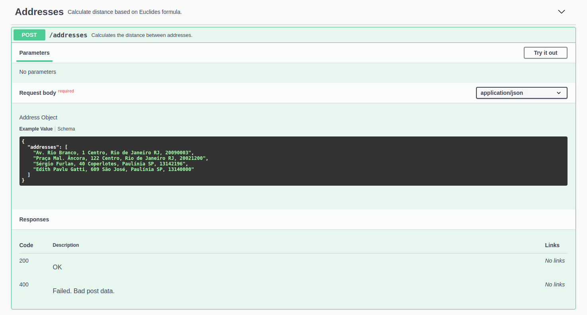

# geolocation-api

- NodeJs API using Express
- TDD using Jest
- Documentation using Swagger
- CI using GitHub Actions

## Run

```bash
yarn && yarn dev

or

npm i && npm run dev
```

## Get Documentation

http://localhost:3333/api-docs/



## Postman Collection

https://www.getpostman.com/collections/0a386fb464bddba31236

## Run Tests

```bash
yarn test
```
